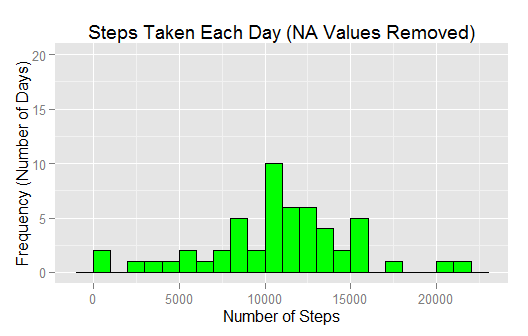
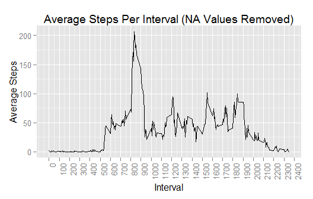
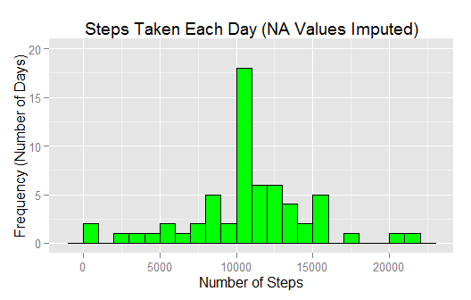
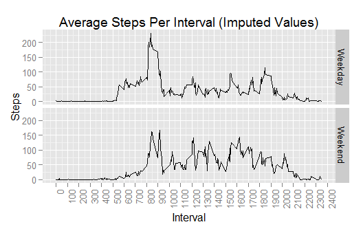

# Reproducible Research: Peer Assessment 1


## Loading and preprocessing the data
*Save two versions of the data: original and with NA values removed.*

```r
ActivityDataRaw <- read.csv(file="activity.csv", header=TRUE, sep=",")
ActivityData = na.omit(ActivityDataRaw)
```

###Steps taken each day  
*Prepare and display histogram of steps taken per day.*

```r
grouped_by_day <- group_by(ActivityData, date)
steps_per_day <- summarize(grouped_by_day,total_steps = sum(steps))

ggplot(data=steps_per_day,aes(x=total_steps)) + 
    geom_histogram(stat="bin", binwidth = 1000, fill= "green",colour = "black") +
    xlab("Number of Steps") +
    ylab("Frequency (Number of Days)") +
    scale_y_continuous(limits=c(0, 20)) +
    ggtitle("Steps Taken Each Day (NA Values Removed)")
```

 

*Calculate the mean and median number of steps taken per day across all intervals and days.*

```r
mean_per_day <- mean(steps_per_day$total_steps)
median_per_day <- median(steps_per_day$total_steps)
```

## What is mean total number of steps taken per day?
The mean steps taken per day is **10766.19** and the median steps taken per day is **10765.00**.

###Average daily activity pattern  
*Display time series plot.*

```r
ggplot(data=ActivityData, aes(x = interval, y = steps)) +
    stat_summary(fun.y="mean", geom="line") +
    xlab("Interval") +
    ylab("Average Steps") +
    ggtitle("Average Steps Per Interval (NA Values Removed)") +
    theme(axis.text.x = element_text(angle = 90, hjust = 1)) +
    scale_x_continuous(breaks=pretty(ActivityData$interval, n=24))
```

 

*Find which 5-minute interval has the maximum mean number of steps.*

```r
grouped_by_interval <- group_by(ActivityData, interval)
mean_steps_per_interval <- summarize(grouped_by_interval,mean_steps = mean(steps))
max_mean_steps_found <- max(mean_steps_per_interval$mean_steps)
interval_with_max_mean_steps <- mean_steps_per_interval[mean_steps_per_interval$mean_steps == max_mean_steps_found,"interval"]
```
## What is the average daily activity pattern?

The interval with the maximum mean number of steps across all days is interval **835** with a mean of **206.17**. NA values have been removed.

## Imputing missing values
*Calculate and report the total number of missing values in the dataset (i.e. the total number of rows with NAs)*

```r
missing_value_row_count <- sum(is.na(ActivityDataRaw))
```
The total number of rows containing missing values in the original dataset is **2304.**  

*Create a new dataset that is equal to the original dataset but with NA values (missing 'steps') filled in. Missing values are filled in using mean 'steps' values rounded to the nearest whole number that have been calculated from corresponding intervals which contain values.*

```r
c <- 0
ActivityDataImputed <- ActivityDataRaw
for (r in 1:nrow(ActivityDataImputed))
{
    if (is.na(ActivityDataImputed[r,"steps"]))
    {
        ActivityDataImputed[r,1] <- 
        round(mean_steps_per_interval[mean_steps_per_interval$interval==ActivityDataImputed[r,"interval"],"mean_steps"],0)
        c <- c + 1
    }
}
```
A total of **2304** values have been imputed.  

*Prepare data and make a histogram of the total number of steps taken each day (NA values Imputed).*

```r
grouped_by_day_imputed <- group_by(ActivityDataImputed, date)
steps_per_day_imputed <- summarize(grouped_by_day_imputed,total_steps = sum(steps))

ggplot(data=steps_per_day_imputed,aes(x=total_steps)) + 
    geom_histogram(stat="bin", binwidth = 1000, fill= "green",colour = "black") +
    xlab("Number of Steps") +
    ylab("Frequency (Number of Days)") +
    scale_y_continuous(limits=c(0, 20)) +
    ggtitle("Steps Taken Each Day (NA Values Imputed)")
```

 

*Calculate the mean and median number of steps taken per day across all intervals and days (imputed) and determine how these values differ from the dataset above with NA values removed.*

```r
grouped_by_day_imputed <- group_by(ActivityDataImputed, date)
steps_per_day_imputed <- summarize(grouped_by_day_imputed,total_steps = sum(steps))
mean_per_day_imputed <- mean(steps_per_day_imputed$total_steps)
median_per_day_imputed <- median(steps_per_day_imputed$total_steps)
mean_difference <-  mean_per_day_imputed - mean_per_day
median_difference <- median_per_day_imputed - median_per_day
```

Dataset with imputed values:

* Mean steps taken per day: **10766.00** (10766.19)
* Median steps taken per day: **10762.00** (10765.00)

(Values in brackets are with NA values removed)  

The difference of means and medians between the two datasets ('imputed values' - 'NA values removed'):

* Mean difference: **-0.55**
* Median difference: **-3.00**

##Do these values differ from the estimates from the first part of the assignment?
The differences between the mean and median values of the two data sets are small.

##What is the impact of imputing missing data on the estimates of the total daily number of steps?
The impact of imputing missing data on daily activity patterns is minimal. The most notable change is the frequency of days that between 10000 and 11000 steps were taken had increased by about 8 days.

###Comparing differences in activities between weekdays and weekends

*Create a new factor variable 'weekday_names' in the 'ActivityDataimputed' dataset with two levels - 'weekday' and "weekend' indicating whether a given date is a weekday or weekend day.*

```r
weekday_names <- c('Monday', 'Tuesday', 'Wednesday', 'Thursday', 'Friday')
ActivityDataImputed$day_type <- as.factor(ifelse(((weekdays(as.Date(ActivityDataImputed$date))) %in% weekday_names),"Weekday","Weekend"))
```

*Generate a time series plot of mean activity per 5-minute intervals*

```r
ggplot(data=ActivityDataImputed, aes(x = interval, y = steps)) +
    stat_summary(fun.y="mean", geom="line") +
    xlab("Interval") +
    ylab("Steps") +
    ggtitle("Average Steps Per Interval (Imputed Values)") +   
    theme(axis.text.x = element_text(angle = 90, hjust = 1)) +
    scale_x_continuous(breaks=pretty(ActivityDataImputed$interval, n=24)) +
    facet_grid(day_type ~ .)
```

 

## Are there differences in activity patterns between weekdays and weekends?
Differences in activity patterns are evident between weekends and weekdays. During weekdays, higher activity levels are concentrated between intervals 800 and 900, and again between 1800 and 1900. On weekends, activity levels are more consistently spread throughout many of the intervals between 800 and 2000. More consistent and higher levels of activity on weekends may possibly be a result of people have more time to be active during most parts of the day on weekends than on weekdays, perhaps due to employment.
